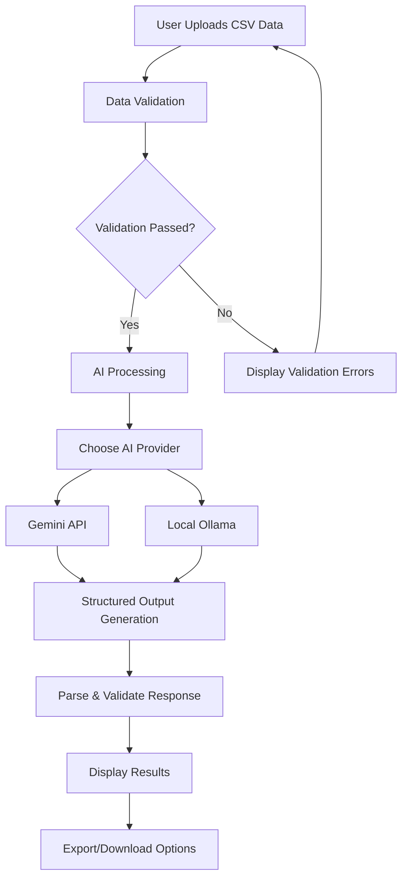
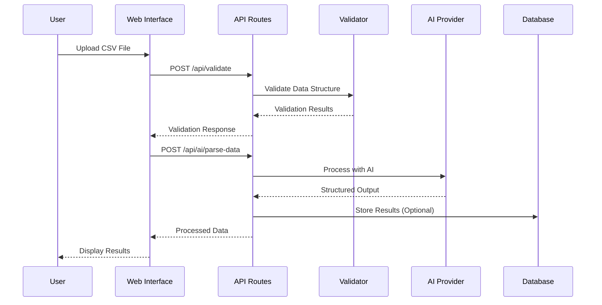
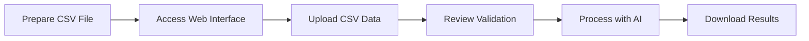

# TidyTable

A powerful data management and analysis platform that leverages artificial intelligence to parse, validate, and process structured data from various sources.

## 📋 Project Description

AI Data Manager is a Next.js-based application that provides intelligent data processing capabilities. It can parse CSV files, validate data integrity, and generate structured outputs using multiple AI providers including Google Gemini and local Ollama models. The application features a modern web interface for data upload, real-time validation, and AI-powered data analysis.

## 🔧 How It Works



### Data Processing Flow



## 🚀 Technologies Used

### Frontend
- **Next.js 14** - React framework with App Router
- **TypeScript** - Type-safe development
- **Tailwind CSS** - Utility-first CSS framework
- **Shadcn/ui** - Modern UI components

### Backend & AI
- **Google Gemini API** - Cloud-based AI processing
- **Ollama** - Local AI model deployment
- **Zod** - Runtime type validation
- **CSV Parser** - Data processing utilities

### Infrastructure
- **Docker** - Containerized Ollama deployment
- **Docker Compose** - Multi-service orchestration

## 🛠️ Local Setup

### Prerequisites
- Node.js 18+ and npm/yarn
- Docker and Docker Compose
- Git

### 1. Clone the Repository
```bash
git clone <repository-url>
cd ai-data-manager
```

### 2. Install Dependencies
```bash
npm install
# or
yarn install
```

### 3. Environment Configuration
Create a `.env.local` file in the root directory:

```env
# Google Gemini API (Optional)
GOOGLE_API_KEY=your_gemini_api_key_here

# Ollama Configuration
OLLAMA_MODEL=llama2
OLLAMA_BASE_URL=http://localhost:11434

# AI Provider Selection
AI_PROVIDER=ollama  # or 'gemini'
```

### 4. Start Ollama (Local AI)
```bash
# Start Ollama container
docker-compose up -d

# Pull a model (wait for container to be ready)
docker exec ai-data-manager-ollama ollama pull llama2

# Verify model is available
docker exec ai-data-manager-ollama ollama list
```

### 5. Run the Application
```bash
npm run dev
# or
yarn dev
```

The application will be available at `http://localhost:3000`

## 📊 Usage

### Data Upload Flow


### Sample CSV Format
```csv
ClientID,ClientName,PriorityLevel,RequestedTaskIDs,GroupTag,AttributesJSON
C1,Acme Corp,3,"T17,T27,T33",GroupA,"{""location"":""New York""}"
C2,Globex Inc,1,"T35,T39,T10",GroupB,"Standard processing"
```

### Features
- **Data Validation**: Real-time CSV structure validation
- **AI Processing**: Intelligent data parsing and structuring
- **Multiple AI Providers**: Switch between Gemini and Ollama
- **Error Handling**: Comprehensive error reporting and retry logic
- **Export Options**: Download processed results

## 🔧 Configuration

### AI Provider Setup

**For Google Gemini:**
1. Get API key from [Google AI Studio](https://aistudio.google.com)
2. Set `AI_PROVIDER=gemini` in `.env.local`
3. Add your API key to `GOOGLE_API_KEY`

**For Local Ollama:**
1. Ensure Docker is running
2. Set `AI_PROVIDER=ollama` in `.env.local`
3. Choose your preferred model in `OLLAMA_MODEL`

### Available Models
- **Ollama**: llama2, mistral, codellama, etc.
- **Gemini**: gemini-1.5-pro, gemini-1.5-flash

## 🐛 Troubleshooting

### Common Issues

**Ollama Model Not Found:**
```bash
docker exec ai-data-manager-ollama ollama pull llama2
```

**Rate Limits with Gemini:**
- Switch to Ollama for unlimited local processing
- Implement request queuing for high-volume usage

**Docker Issues:**
```bash
docker-compose down
docker-compose up -d --build
```

## 📈 Development

### Project Structure
```
├── app/                 # Next.js App Router
│   ├── api/            # API routes
│   └── components/     # React components
├── src/
│   ├── utils/          # Utility functions
│   └── types/          # TypeScript types
├── docker-compose.yml  # Ollama setup
└── README.md
```

### Contributing
1. Fork the repository
2. Create a feature branch
3. Make your changes
4. Add tests if applicable
5. Submit a pull request

## 📄 License

This project is licensed under the MIT License - see the LICENSE file for
